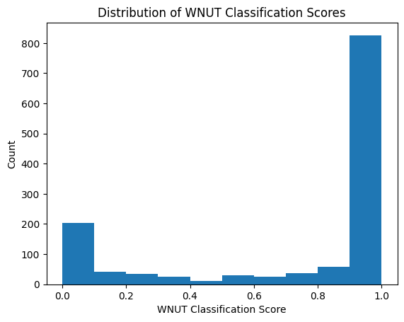
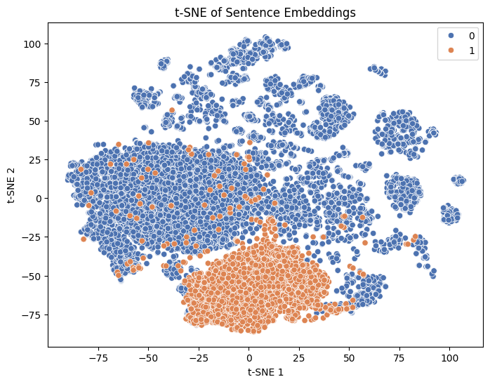
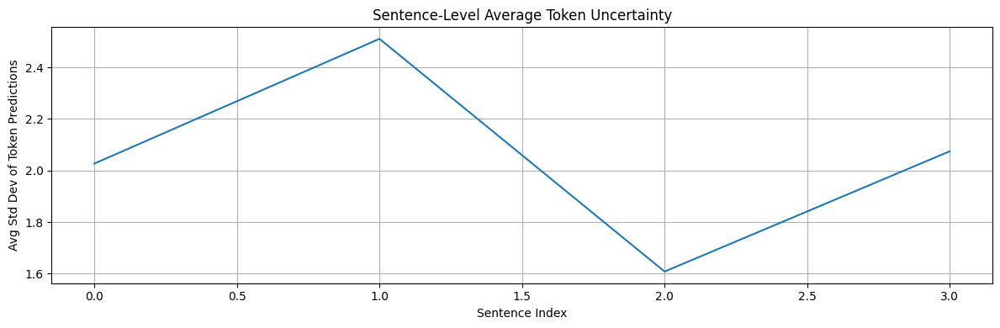
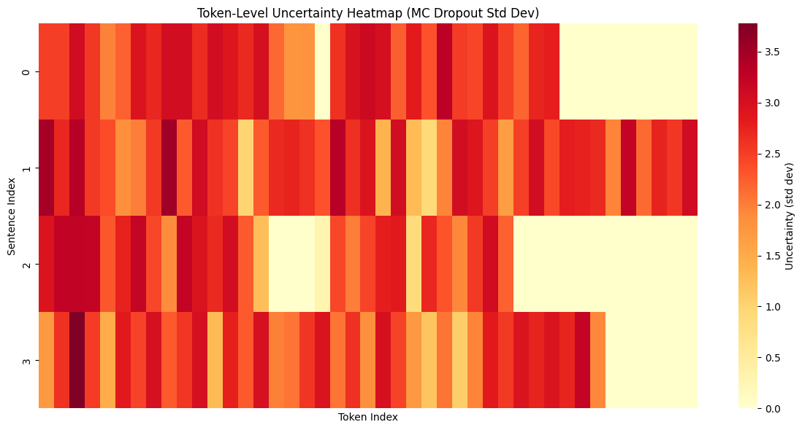
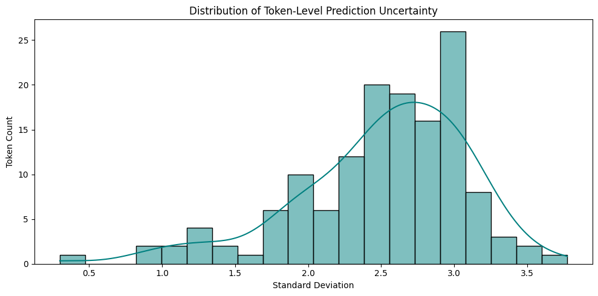

# Robustness and Uncertainty in BERT-based Named Entity Recognition

This project explores the robustness, confidence, and transferability of a Named Entity Recognition (NER) system across domains. We use a BERT-based architecture, enhanced with Conditional Random Fields (CRF) and Monte Carlo Dropout, to investigate how a model trained on clean, formal data (CoNLL-2003) performs on noisy, real-world text (WNUT-17).

Key research questions include: How does a pretrained NER model behave on out-of-domain data? Can we quantify uncertainty and difficulty at sentence and token levels? What do embedding visualizations and classifier scores tell us about domain shift? How can these insights be used to improve model performance or interpretability?

---

## 🗂️ Datasets

### 1. **CoNLL-2003**
- Domain: Reuters newswire  
- Entities: PER, ORG, LOC, MISC  
- Characteristics: Clean, structured, and formal language

### 2. **WNUT-17**
- Domain: User-generated content (e.g., Twitter)  
- Entities: person, location, corporation, product, creative-work, group  
- Characteristics: Noisy, emerging entities with slang and irregular grammar

---

## 🎯 Project Objectives

### 🔍 Evaluation

- Zero-shot test a pretrained BERT-based NER model on CoNLL-2003 and WNUT-17.
- Normalize entity labels to enable fair cross-domain comparison.

### 📊 Analysis

- Train a logistic regression model to separate WNUT and CoNLL based on sentence embeddings.
- Use model scores as difficulty estimates and correlate with NER F1 performance.

### 🧪 Uncertainty

- Add a CRF decoding layer to model structured dependencies.
- Use Monte Carlo (MC) Dropout to estimate prediction variance.
- Visualize model uncertainty at token and sentence level.

---

## 🛠️ Methodology

### 1️⃣ Tokenization & Preprocessing

- Sentences are tokenized using BERT’s WordPiece tokenizer.
- Original labels are aligned with tokenized output.

### 2️⃣ Inference Pipeline

- Inference uses `dslim/bert-base-NER` without fine-tuning.
- Predictions are evaluated on both test sets using F1, Precision, Recall.

### 3️⃣ Difficulty Modeling with Logistic Regression

A logistic regression model is trained to distinguish between CoNLL and WNUT sentences based on the `[CLS]` token embeddings from BERT. The probability score produced by this model serves as a "WNUT-likeness" measure.

#### 
**Distribution of WNUT Classification Scores**

This histogram visualizes the output of a logistic regression classifier trained to distinguish WNUT from CoNLL sentences using sentence-level BERT embeddings. The **x-axis** shows probability scores between 0 and 1, where values near 1.0 indicate strong WNUT domain identity and values near 0.0 suggest a CoNLL-like profile. The **y-axis** represents the frequency of these scores across the WNUT test set.

Most test sentences are scored close to **1.0**, showing that the classifier clearly detects WNUT’s domain characteristics. However, a tail of lower scores exists—these are likely examples that structurally or lexically resemble CoNLL data. This bimodal or right-skewed distribution is evidence of **strong domain separation**. For NER, this means that sentences with scores closer to 0.0—those that look more “CoNLL-like”—tend to be harder for the WNUT-unaware model to label correctly. This supports the use of such scoring to estimate difficulty and improve performance through domain adaptation techniques.

### 4️⃣ t-SNE Visualization of Sentence Embeddings

#### 
**t-SNE Plot of Sentence Embeddings**

This scatter plot presents a t-SNE projection of `[CLS]` token embeddings from BERT, with sentences from the CoNLL and WNUT datasets color-coded. Orange points represent WNUT sentences; blue points represent CoNLL. 

The embeddings form **two largely separate clusters**, indicating that BERT encodes distinguishable representations for the two domains. WNUT embeddings are relatively **tight and cohesive**, whereas CoNLL embeddings appear more **diffuse**. This reinforces the idea of **domain shift**—the model learns distinct patterns and features for each domain. Such visualization is useful to confirm whether additional domain-aware strategies (e.g., fine-tuning, domain adversarial training) are necessary for improved cross-domain generalization.

---

## 🔍 Uncertainty Estimation: BERT + CRF + MC Dropout

### 🧩 Architecture

- Base Model: `bert-base-cased`
- Decoder: Linear → CRF Layer

### 🔄 Monte Carlo Dropout

Dropout layers are kept active during inference to simulate multiple forward passes. This allows estimation of variance across predictions, which is interpreted as uncertainty.

### 📊 Visualizations

#### 
**Sentence-Level Average Token Uncertainty**

The **Sentence-Level Average Token Uncertainty** plot presents an aggregated view of the model’s uncertainty across different sentences by averaging the token-level uncertainty values for each sentence. This visualization helps identify which sentences the model finds more ambiguous or challenging as a whole, rather than focusing on individual token predictions.In the plotted graph, the x-axis corresponds to the sentence indices, while the y-axis represents the average standard deviation (uncertainty) of the tokens in each sentence. From the observed trends, it is evident that some sentences exhibit consistently higher average uncertainty compared to others. This suggests that these sentences likely contain more informal, rare, or contextually ambiguous language—characteristics typical of the WNUT dataset, which deals with noisy user-generated content like tweets and social media posts.Such variation implies that the model’s confidence is influenced not only by token-level features but also by sentence-level semantics and structure. Sentences with lower average uncertainty may consist of more common or well-understood expressions, while those with higher values could include entities, misspellings, or novel phrases that the model struggles to generalize from its training data.


#### 
**Token-Level Uncertainty Heatmap**

The token-level uncertainty heatmap provides a detailed visualization of how uncertain the BERT+CRF model is about each token in the test set sentences when exposed to noisy, informal data (such as the WNUT dataset). The y-axis represents the sentence indices, while the x-axis corresponds to individual token positions within each sentence. The color intensity indicates the level of uncertainty measured as the standard deviation from multiple forward passes using Monte Carlo Dropout: darker shades (reds and maroons) signify higher uncertainty, while lighter shades (yellows to whites) denote low or no uncertainty.From the heatmap, we observe clear token-level variability in uncertainty across all sentences. Some tokens show consistently high uncertainty, likely due to being rare, noisy, or out-of-distribution—such as slang, misspellings, or unconventional named entities. These tokens are where the model struggles the most, highlighting areas where its confidence is significantly reduced. On the other hand, certain regions, especially toward the right end of each row, appear white, indicating zero uncertainty. These are most likely padding tokens added to maintain uniform sequence lengths and are ignored during prediction.Overall, this fine-grained visualization complements the sentence-level uncertainty trends and offers valuable insights into which specific parts of each input the model finds difficult to interpret. This reinforces the impact of domain shift—from formal CoNLL data to informal WNUT data—and emphasizes the need for improved robustness, better data augmentation, or domain adaptation techniques to handle noisy text more effectively. 


#### 
**Distribution of Token-Level Prediction Uncertainty**

The distribution plot of token-level prediction uncertainty offers a statistical overview of how uncertain the model is across all tokens in the test set. The x-axis represents the standard deviation values, which quantify uncertainty obtained via Monte Carlo (MC) Dropout, while the y-axis shows the count of tokens corresponding to each uncertainty range. The superimposed KDE (Kernel Density Estimate) curve provides a smoothed view of the overall distribution trend. From this graph, we can observe that the distribution of uncertainty is slightly right-skewed, with the majority of tokens showing a moderate level of uncertainty—mostly between 2.0 and 3.0 standard deviation. This indicates that while the model is relatively confident for many tokens, a substantial portion still exhibits significant uncertainty, especially in noisy or out-of-distribution contexts. A smaller number of tokens have very low uncertainty (near 0.5–1.5), which could represent high-frequency or unambiguous tokens. Conversely, the tail on the right includes tokens with extreme uncertainty (>3.0), likely corresponding to rare or non-standard expressions present in the informal WNUT dataset.This visualization reinforces the earlier findings from the heatmap by showing that token-level prediction uncertainty is not uniform but rather follows a bell-like curve with a long tail. 

---

## 🔍 Insights

- The BERT model shows **strong in-domain performance** (CoNLL), but **struggles with out-of-domain (WNUT)** text.
- Sentence-level embeddings and classification scores highlight **clear domain boundaries**.
- t-SNE visualizations confirm the **latent separation** of domains in embedding space.
- Token-level uncertainty via MC Dropout reveals **where and why** predictions become unreliable.
- Examples with low WNUT scores often correlate with lower NER F1 performance, reinforcing the utility of domain score as a difficulty proxy.

---

## 💡 Why This Matters

In real-world applications, NER systems often face **domain drift**—where the training data differs significantly from the deployment environment. This project:

- Demonstrates the **impact of domain shift** using real datasets.
- Introduces **uncertainty quantification** for NER models.
- Uses modern deep learning (BERT + CRF, MC Dropout) to probe model behavior **beyond accuracy metrics**.
- Validates the importance of embedding analysis and prediction variance as interpretability tools.

---

## 🛠️ Setup

### Python Version
`Python 3.10`

---

## 📄 License

This project is licensed under the [MIT License](https://opensource.org/licenses/MIT).  
You are free to use, modify, and distribute this code for personal or commercial use, provided that you include proper attribution.

```
MIT License

Copyright (c) 2025 Yash Kathane

Permission is hereby granted, free of charge, to any person obtaining a copy
of this software and associated documentation files (the "Software"), to deal
in the Software without restriction, including without limitation the rights 
to use, copy, modify, merge, publish, distribute, sublicense, and/or sell 
copies of the Software, and to permit persons to whom the Software is 
furnished to do so, subject to the following conditions:

The above copyright notice and this permission notice shall be included in 
all copies or substantial portions of the Software.

THE SOFTWARE IS PROVIDED "AS IS", WITHOUT WARRANTY OF ANY KIND, EXPRESS OR 
IMPLIED, INCLUDING BUT NOT LIMITED TO THE WARRANTIES OF MERCHANTABILITY, 
FITNESS FOR A PARTICULAR PURPOSE AND NONINFRINGEMENT. IN NO EVENT SHALL THE 
AUTHORS OR COPYRIGHT HOLDERS BE LIABLE FOR ANY CLAIM, DAMAGES OR OTHER 
LIABILITY, WHETHER IN AN ACTION OF CONTRACT, TORT OR OTHERWISE, ARISING FROM, 
OUT OF OR IN CONNECTION WITH THE SOFTWARE OR THE USE OR OTHER DEALINGS IN 
THE SOFTWARE.
```


